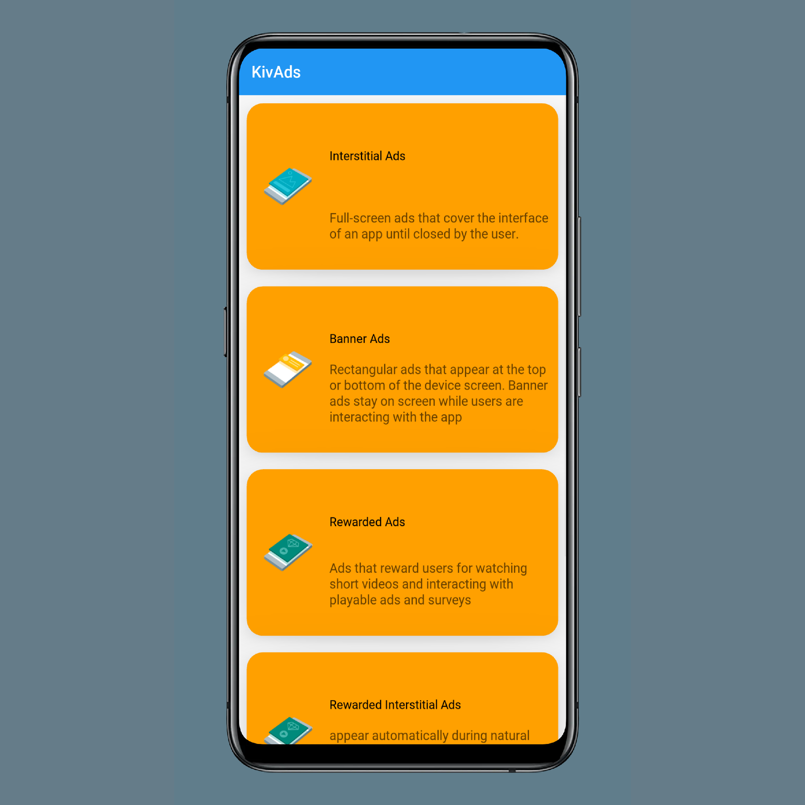

.. KivAds documentation master file, created by
   sphinx-quickstart on Sun Sep 19 22:02:27 2021.
   You can adapt this file completely to your liking, but it should at least
   contain the root `toctree` directive.

Welcome to KivAds's documentation!
==================================

KivAds is a Library that allows you to monetize your Kivy Apps using Google Admob. KivAds provides an easy to use way of implementing many different types of ads into your kivy apps.
KivAds uses the latest version of Google AdMob sdk `20.0.3`.

.. toctree::
   :maxdepth: 2
   :caption: Contents:

   gettingstarted
   demo
   api

Indices and tables
==================

* :ref:`genindex`
* :ref:`modindex`
* :ref:`search`
